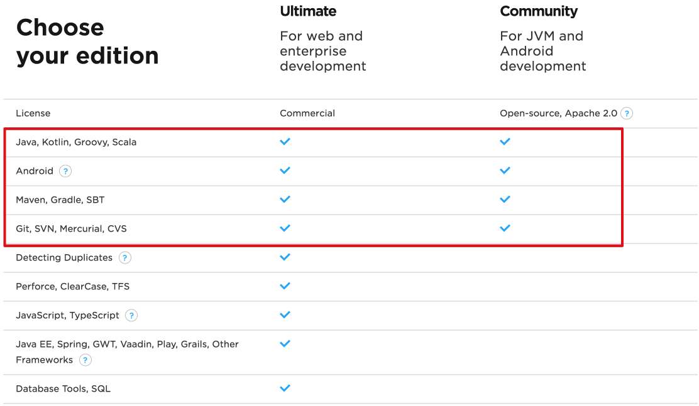
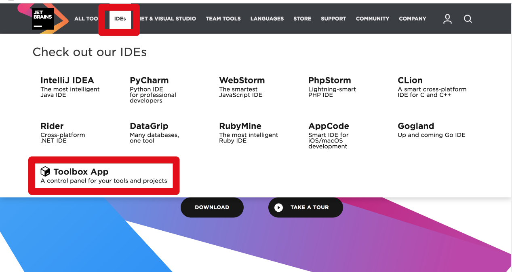
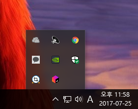
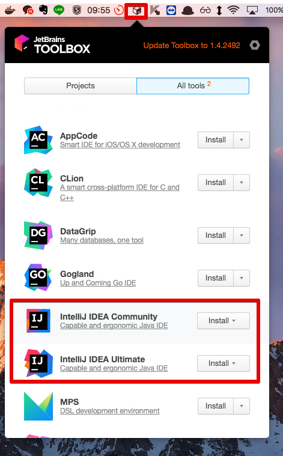
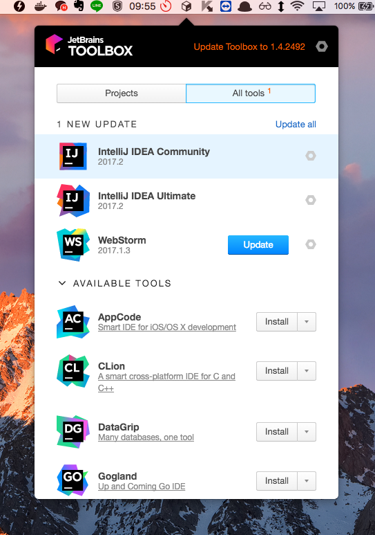
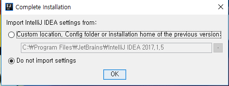
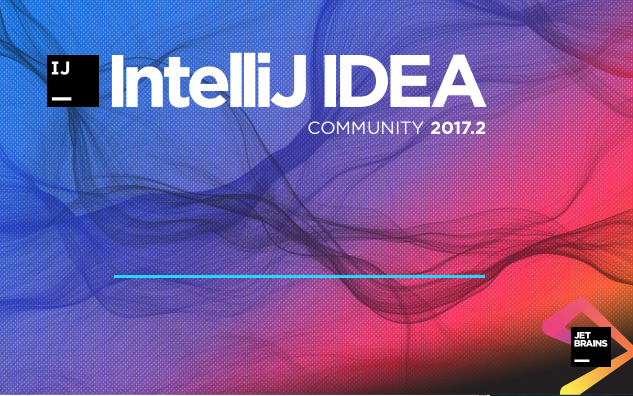

# 소개

IntelliJ IDEA (이하 IntelliJ)는 최근들어 크게 각광받는 JVM 언어(Java, Kotlin, Scala, Groovy)들의 IDE입니다.  
기존엔 안드로이드 스튜디오의 Base IDE로만 알려져 있었지만, 점점 막강한 점이 알려져 많은 서비스 기업들(네이버, 카카오, 라인, 쿠팡, 우아한형제들 등)에서 적극적으로 도입하고 있습니다.  

모든 과정은 Mac OS (Sierra), IntelliJ 2017.2 버전에서 진행됨을 미리 말씀드립니다.

### Community vs Ultimate

IntelliJ는 현재 무료버전인 Community와 유료버전인 Ultimate이 있습니다.  
둘의 차이는 아래의 표와 같습니다.

즉, 무료로 사용할 수 있는 Community 버전에서는 JVM 언어, Git, Maven/Gradle 까지만 사용가능하며, **웹 관련 기능은 전혀 사용할 수 없습니다**.  
Ultimate의 경우 처음 설치시 Free 라이센스를 제공하여 **한달간 사용 가능**합니다.  

Ultimate의 가격은 

자세한 내용은 [https://www.jetbrains.com/idea/buy/#edition=commercial](https://www.jetbrains.com/idea/buy/#edition=commercial)를 참고하시면 됩니다.

### ToolBox

IntelliJ 사이트에서 바로 설치파일을 받아도 좋지만, IDE의 버전과 여러 설정을 좀 더 편하게 관리하기 위해 ToolBox를 설치해서 진행하겠습니다.  

IntelliJ 공식 사이트인 [https://www.jetbrains.com/idea/](https://www.jetbrains.com/idea/)에 접속하셔서 Tool Box를 다운받아 설치하겠습니다.

설치가 끝나시면 윈도우에선 우측하단에, 맥에선 화면 상단에 툴박스 아이콘이 표기됩니다.  
해당 아이콘을 클릭하여 IntelliJ 설치를 진행해보겠습니다.

(윈도우 Tool Box)

(Mac Tool Box)  
  
라이센스가 있으신 분들은 Ultimate를 Install 하시고, 없으시다면 일단 Community를 Install해서 진행하겠습니다.  
(중반부까지는 Community 버전으로 진행하며, 후반부에선 Spring & SpringBoot를 사용해야되어 Ultimate이 꼭 필요합니다.)  
  
설치 완료후 다시 아이콘을 클릭하시면 IntelliJ들이 설치된 것을 확인할 수 있습니다.

설치하신 IntelliJ를 클릭하시면 초기 설정을 시작하게 됩니다.

기존에 IntelliJ를 설치하셨다면, 기존 설정값을 가져올것인지 묻는것인데, 이번이 처음이시면 바로 OK 하시면 됩니다.  

